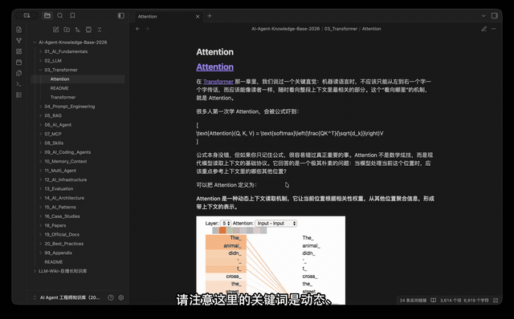

# Screencast Explainer

**English** | [简体中文](README.zh-CN.md)

Cross-platform Agent skill for producing **real desktop app screencast explainer videos** (narration + burned-in subtitles), not black-background subtitle-only videos.

## Demo

Real Obsidian screencast explainer (Obsidian · Transformer + Attention). GIF preview shows burned-in subtitles and scroll; full video has narration on YouTube.

[](https://youtu.be/Es6ZjRlRd_Q)

**Full version (~10 min):** [Watch on YouTube](https://youtu.be/Es6ZjRlRd_Q)

## One-line install

Send this to your Agent:

```
Install Screencast Explainer: https://raw.githubusercontent.com/bitOpc/ScreencastExplainer/main/docs/install.md
```

The Agent follows [docs/install.md](docs/install.md) to clone into `~/.screencast-explainer`, create a venv, and install the skill **only on the current Agent platform** (not all four by default). To update, see [docs/update.md](docs/update.md).

## Supported platforms

| Platform | Install path |
|----------|--------------|
| Hermes | `~/.hermes/profiles/ailearn/skills/screencast-explainer/` |
| Codex | `~/.codex/skills/screencast-explainer/` |
| Claude Code | `~/.claude/skills/screencast-explainer/` |
| OpenClaw | `~/.agents/skills/screencast-explainer/` |

## Quick start

### 1. Clone and dependencies

```bash
git clone https://github.com/bitOpc/ScreencastExplainer.git
cd ScreencastExplainer

# Runtime Python deps
pip install -r requirements.txt

# Dev deps (pytest, optional)
pip install -r requirements-dev.txt
```

### 2. System dependencies

```bash
# macOS recommended
brew install ffmpeg
```

You also need: Python 3.10+, macOS `screencapture` (built-in), Screen Recording permission for the Agent/terminal host, and Agent-side Computer Use.

### 3. Install the skill

```bash
./install.sh                  # all platforms
./install.sh --platform codex # or a single platform
./install.sh --dry-run        # preview only
```

### 4. Verify environment

```bash
python3 skill/scripts/doctor.py
python3 skill/scripts/doctor.py --json
```

### 5. End-to-end workflow (Agent-driven)

| Step | Who | Action |
|------|-----|--------|
| 0 | Agent + script | `doctor.py` dependency check |
| 1 | Agent | Parse user input (target app, duration, voice, etc.) |
| 2 | Agent | Computer Use opens the target UI |
| 3 | Agent | Write `script.md` |
| 4 | Agent + script | Write `segments.json`, run `init_run.py` |
| 5 | Script | `build_narration.py` generates narration and captions |
| 6 | Agent | Computer Use calibrates UI actions, writes `actions.json` |
| 7 | Script | `run_recording.py` single-window capture + cua-driver local timeline playback |
| 8 | Script | `ingest_capture.py` → `compose_video.py` → `build_cover.py` |
| 9 | Agent | Deliver final video, cover, audio, captions, and duration |

```bash
RUN=outputs/my-run-$(date +%Y%m%d-%H%M%S)

python3 skill/scripts/doctor.py --json
python3 skill/scripts/init_run.py --output-dir "$RUN"
# Agent writes $RUN/script.md, $RUN/segments.json, and $RUN/actions.json
python3 skill/scripts/build_narration.py --output-dir "$RUN"

# After Agent obtains window_id:
python3 skill/scripts/timeline_player.py --actions "$RUN/actions.json" --output-dir "$RUN" --dry-run
python3 skill/scripts/run_recording.py --output-dir "$RUN" --window-id <WINDOW_ID>

python3 skill/scripts/ingest_capture.py --output-dir "$RUN"
python3 skill/scripts/compose_video.py --output-dir "$RUN"
python3 skill/scripts/build_cover.py --output-dir "$RUN"
```

Single-window recording: `skill/references/recording-window.md`. Action timeline: `skill/references/action-timeline.md`.

Final outputs: `$RUN/video/final.mp4`, `$RUN/video/cover.png`

## Directory layout

```
ScreencastExplainer/
├── skill/                      # Skill root (symlinked by install.sh)
│   ├── SKILL.md                # Agent workflow (Chinese)
│   ├── references/             # Reference docs (Chinese)
│   │   ├── standard-pipeline.md
│   │   ├── voice-presets.md
│   │   ├── failure-modes.md
│   │   ├── segment-schema.md
│   │   ├── action-timeline.md
│   │   └── install-paths.md
│   └── scripts/
│       ├── doctor.py
│       ├── init_run.py
│       ├── build_narration.py
│       ├── timeline_player.py
│       ├── run_recording.py
│       ├── ingest_capture.py
│       ├── compose_video.py
│       └── build_cover.py
├── install.sh
├── requirements.txt
├── requirements-dev.txt
├── tests/
├── docs/
└── outputs/                    # Run output (gitignored)
    └── <run-id>/
        ├── run.json
        ├── script.md
        ├── segments.json
        ├── actions.json
        ├── actions.report.json
        ├── narration.wav
        ├── captions.srt
        ├── captions.ass
        ├── capture/raw.mp4
        └── video/
            ├── normalized.mp4
            ├── final.mp4
            └── cover.png
```

## Documentation

| Document | Description |
|----------|-------------|
| [skill/SKILL.md](skill/SKILL.md) | Agent workflow (steps 0–9) |
| [skill/references/standard-pipeline.md](skill/references/standard-pipeline.md) | Computer Use + Python + ffmpeg architecture |
| [skill/references/voice-presets.md](skill/references/voice-presets.md) | Default voice and configurable fields |
| [skill/references/failure-modes.md](skill/references/failure-modes.md) | Four common failure modes |
| [skill/references/segment-schema.md](skill/references/segment-schema.md) | `segments.json` data model |
| [skill/references/action-timeline.md](skill/references/action-timeline.md) | `actions.json` generic UI action timeline |
| [skill/references/install-paths.md](skill/references/install-paths.md) | Four-platform install paths |
| [skill/references/computer-use-token-policy.md](skill/references/computer-use-token-policy.md) | Token-saving strategy (Agent guidance) |
| [docs/install.md](docs/install.md) | Agent one-line install playbook |
| [docs/update.md](docs/update.md) | Agent update playbook |

## Tests

```bash
pip install -r requirements-dev.txt
pytest
```

## Smoke test

Run the full Python pipeline with a placeholder video (no real desktop capture) to verify narration, captions, and composition.

**Prerequisites:** Python deps (`requirements.txt`), ffmpeg, and `doctor.py` all passing. `build_narration.py` needs network access for Edge TTS.

```bash
source .venv/bin/activate   # if using a venv
RUN=outputs/smoke-$(date +%Y%m%d-%H%M%S)

python3 skill/scripts/doctor.py
python3 skill/scripts/init_run.py --output-dir "$RUN"

# Write script.md and segments.json (draft, 2 short narration segments)
# See skill/references/segment-schema.md for an example

python3 skill/scripts/build_narration.py --output-dir "$RUN"

# Black placeholder video aligned with narration.wav duration
AUDIO_DUR=$(ffprobe -v error -show_entries format=duration -of csv=p=0 "$RUN/narration.wav")
ffmpeg -y -f lavfi -i color=c=black:s=1920x1080:d=$AUDIO_DUR -pix_fmt yuv420p "$RUN/capture/raw.mp4"

python3 skill/scripts/ingest_capture.py --output-dir "$RUN"
python3 skill/scripts/compose_video.py --output-dir "$RUN"
```

**Expected:**

- `$RUN/narration.wav`, `captions.srt`, `captions.ass` exist
- `segments.json` status is `narrated`
- `$RUN/video/final.mp4` plays with burned-in subtitles and narration

**Full unit tests:**

```bash
pytest -v
```

Expected: 49 passed

## Uninstall

```bash
./install.sh --uninstall
```
